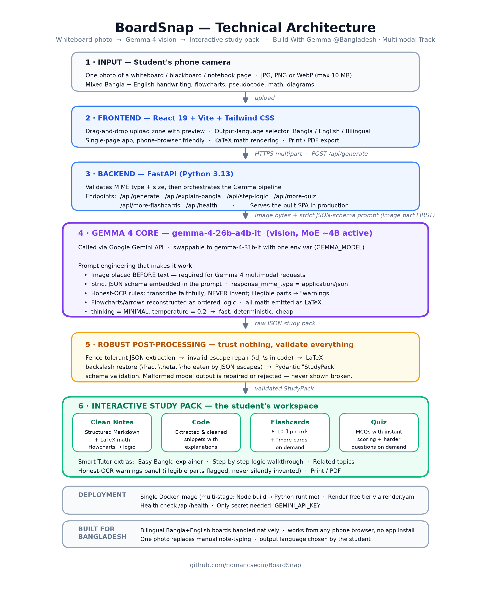
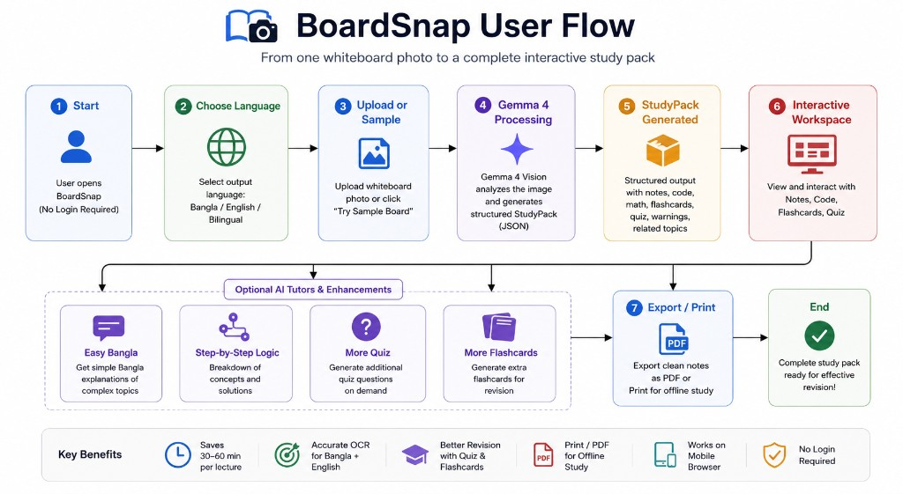

<div align="center">

# BoardSnap — Whiteboard to Interactive Study Guide

**Snap one photo of a messy Bangla + English whiteboard. Get clean notes, code, flashcards and a quiz — in ~20 seconds.**

*Build With Gemma @Bangladesh · Multimodal Track (Gemma 4 Vision)*

[](#how-gemma-is-used)
[](#technical-architecture)
[](#technical-architecture)
[](#run-it-yourself)

</div>

---

> **Demo video:** _link coming soon_ &nbsp;·&nbsp; **Live app:** _link coming soon_ &nbsp;·&nbsp; **Sample board:** [`samples/test-board.png`](samples/test-board.png)

## Problem Statement

In Bangladesh, classrooms — from HSC coaching centers in Dhaka to university lecture halls in Sylhet — run on **whiteboards filled with a mix of Bangla and English**: flowcharts, pseudocode, math derivations, and fast, messy handwriting.

What students actually do today:

- They **photograph the board** before it gets erased — almost every student's gallery is full of board photos.
- Those photos are **nearly useless for revision**: low contrast, sideways angles, mixed languages, half-erased diagrams.
- Re-typing notes by hand takes **30–60 minutes per lecture**, and most students simply never do it.
- Commercial note/OCR apps handle English print text, but **fail on handwritten Bangla** and mixed-script boards — and none of them turn a board into *study material*.

The result: the single most common study artifact in Bangladesh — the board photo — is a dead end. **BoardSnap turns it into the starting point.**

## Solution Overview

BoardSnap is a web application (works in any phone browser, no install) that converts **one whiteboard photo** into a complete, interactive study pack:

| Output | What you get |
|---|---|
| **Clean Notes** | Structured Markdown reconstruction of the board — flowcharts become ordered logic, math becomes rendered LaTeX |
| **Code** | Every code/pseudocode fragment extracted, cleaned up, and explained |
| **Flashcards** | 6–10 flip cards testing the *actual* board content — with "more cards" on demand |
| **Quiz** | Multiple-choice questions with instant scoring — with harder questions on demand |
| **Honest OCR** | Illegible parts go to a **warnings panel** instead of being silently invented |
| **Smart Tutor** | One-tap "Easy Bangla" explanation and step-by-step logic walkthrough |
| **Print / PDF** | Clean printable study notes for offline revision |

Output language is the student's choice: **বাংলা / English / Bilingual**.

This is **not a chatbot**. There is no free-form chat loop — the core value is an automated *vision → structured data → interactive workspace* pipeline that replaces 30–60 minutes of manual transcription with one upload.

## How Gemma Is Used

Gemma is the **core engine** of BoardSnap — every feature is powered by it.

- **Model:** [`gemma-4-26b-a4b-it`](https://ai.google.dev/gemma) — Gemma 4 vision, Mixture-of-Experts with **~4B active parameters**: fast and cheap enough for a free-tier deployment, capable enough to read handwritten Bangla + English boards. Swappable to `gemma-4-31b-it` via a single env var (`GEMMA_MODEL`).
- **Access:** Google Gemini API (`google-genai` SDK). The design ports directly to self-hosted Gemma weights since it relies only on standard multimodal generation.

**Prompt / architecture decisions that make it work:**

1. **Image part placed *before* the text prompt** — required for reliable Gemma 4 multimodal requests.
2. **Strict JSON schema embedded in the prompt** + `response_mime_type: application/json` — the board photo comes back as one machine-readable `StudyPack` object (notes, code, flashcards, quiz, warnings, related topics) in a single call.
3. **Honest-OCR rules:** *transcribe faithfully, never invent; if a region is illegible, report it in `warnings`*. This makes the tool trustworthy for exam prep — hallucination is treated as a first-class failure mode.
4. **Flowchart reconstruction:** arrows and boxes on the board are rewritten as ordered logic steps; all math is emitted as single-line LaTeX so it renders perfectly with KaTeX.
5. **`thinking_level=MINIMAL`, `temperature=0.2`** — deterministic, fast responses suited to structured extraction.
6. **Defense-in-depth output handling:** fence-tolerant JSON extraction → invalid-escape repair (`\d`, `\s` inside code) → LaTeX backslash restoration (`\frac`, `\theta` eaten by JSON escapes) → **Pydantic validation**. Malformed model output is repaired or rejected — never shown broken to the student.

Four additional Gemma-powered endpoints (Easy-Bangla explainer, step-by-step tutor, more-quiz, more-flashcards) reuse the validated notes as grounded context, so every generated question stays faithful to what was actually on the board.

## Technical Architecture



**Stack summary:** React 19 + Vite + Tailwind (frontend) · FastAPI, Python 3.13 (backend) · Gemma 4 via Gemini API (intelligence) · Pydantic (validation) · Docker multi-stage build → single image, deployed on Render's free tier (`render.yaml` included).

## User Flow



## Impact & Validation

- **Time saved:** one upload (~20 s end-to-end) replaces 30–60 minutes of manual note transcription per lecture.
- **Tested on real board content:** a sample messy bilingual CS board (control flow + pseudocode + math, [`samples/test-board.png`](samples/test-board.png)) is included in the repo — the app correctly reconstructs the flowchart as ordered logic, extracts runnable code, and renders the math in LaTeX.
- **Hallucination safety:** the warnings panel surfaces genuinely illegible regions instead of inventing content — validated by deliberately photographing boards with smudged sections.
- **Accessibility:** output in সহজ বাংলা makes English-medium technical boards usable for Bangla-medium students — the "Easy Bangla" tutor was designed specifically for rural HSC students facing English jargon.
- **Reach:** works in any phone browser over a normal mobile connection; the heavy lifting happens server-side, so a ৳10,000 phone works as well as a flagship.

## Run It Yourself

### Prerequisite

A free Gemini API key from [Google AI Studio](https://aistudio.google.com/apikey).

### Option A — Docker (fastest)

```bash
cp .env.example .env          # paste your GEMINI_API_KEY into .env
docker compose up --build     # open http://localhost:8000
```

### Option B — Deploy on Render (one click)

1. Fork/push this repo to GitHub.
2. [Render Dashboard](https://dashboard.render.com) → **New → Blueprint** → select the repo (`render.yaml` does the rest).
3. Set the `GEMINI_API_KEY` environment variable. Health check: `/api/health`.

### Option C — Local development

```bash
# 1. API key
cp .env.example .env                       # paste your GEMINI_API_KEY

# 2. Backend
python3 -m venv .venv
.venv/bin/pip install -r backend/requirements.txt

# 3. Frontend
cd frontend && npm install && npm run build && cd ..

# 4. Serve (FastAPI serves both the API and the built frontend)
cd backend && ../.venv/bin/uvicorn main:app --host 0.0.0.0 --port 8000
```

Hot reload during development:

```bash
cd backend && ../.venv/bin/uvicorn main:app --reload    # terminal 1
cd frontend && npm run dev                              # terminal 2 → http://localhost:5173
```

Try it immediately with the bundled sample board: [`samples/test-board.png`](samples/test-board.png).

## API Reference

| Endpoint | Method | Purpose |
|---|---|---|
| `/api/health` | GET | Model + API-key status |
| `/api/generate` | POST | multipart `image` + `output_language` (`bangla` \| `english` \| `bilingual`) → full study pack |
| `/api/explain-bangla` | POST | Simple-Bangla explanation of the notes |
| `/api/step-logic` | POST | Step-by-step tutor walkthrough (math/code/flowcharts) |
| `/api/more-quiz` | POST | More MCQs by difficulty (`easy` \| `mixed` \| `hard`) |
| `/api/more-flashcards` | POST | More flashcards by difficulty |

## Limitations & Future Work

**Current limitations**

- Very low-light or extreme-angle photos reduce OCR accuracy — the warnings panel mitigates this by flagging uncertain regions instead of guessing.
- Handwritten Bangla **diacritics (কার/ফলা)** are occasionally misread on very messy boards.
- One photo at a time — multi-board lectures need multiple uploads.

**Future work**

- **Fine-tune Gemma on Bangla handwriting** — a LoRA fine-tune of Gemma 4 on a Bangla whiteboard/handwriting dataset is the natural next step for diacritic accuracy.
- **Offline, on-device mode** with a small Gemma variant for load-shedding resilience.
- **Spaced-repetition export** (Anki deck download) and multi-photo lecture stitching.
- **Teacher dashboard** — aggregate quiz results across a class to spot weak topics.

---

<div align="center">

Built for Bangladeshi students · **Build With Gemma @Bangladesh 2026**

</div>
